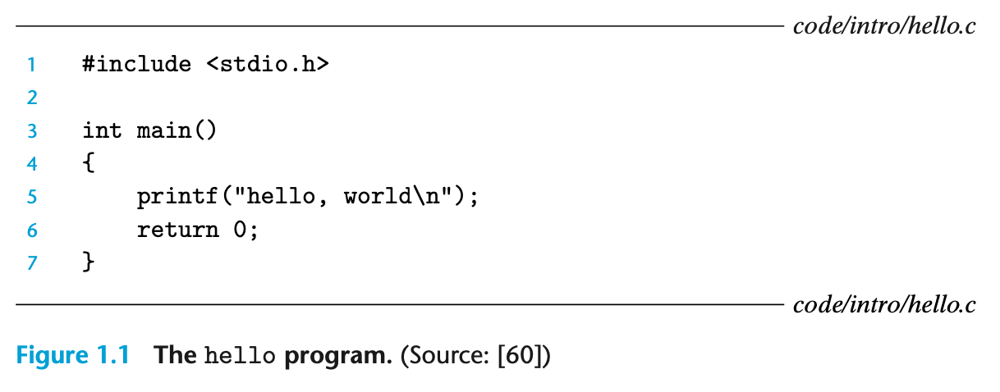
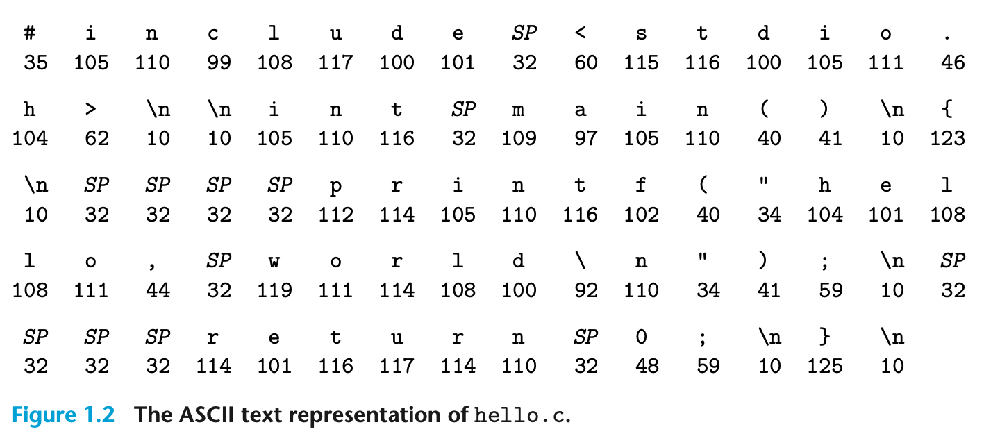

= Computer Systems 
A Programmer’s PerspectiveComputer Systems
:toc:
:toclevels: 4
:toc-title: Table of Contents
:doctype: book
//:author: Alex Petrov <xxx@xxx.org>
:description: This book (known as CS:APP) is for computer scientists, computer engineers, and others who want to be able to write better programs by learning what is going on “under the hood” of a computer system.
:sectanchors: 
:url-repo: https://my-git-repo.com 
:experimental:

== Chapter 1 A Tour of Computer Systems

[.text-indent]
電腦系統由硬體和系統軟體組成，兩者合作運行應用程式。隨著時間的推移，系統的具體實作會有所變化，但底層概念依然不變。所有電腦系統都具有類似的硬體和軟體組成元件，並執行類似的功能。這本書專為希望透過理解這些元件如何運作以及如何影響程式正確性和效能的程式設計師而撰寫。

[.text-indent]
您即將踏上令人興奮的旅程。如果您致力於學習本書中的概念，那麼您將有望成為稀有的人才，也就是「超級程式設計師」，並透過理解底層電腦系統及其對應用程式的影響而變得睿智。

[.text-indent]
您將學習實用的技能，例如如何避免因電腦表示數字的方式而產生的奇怪數值錯誤。您將學習如何利用現代處理器和記憶體系統的設計來優化您的 C 程式碼。 您將學習編譯器如何實作程序呼叫，以及如何利用這些知識來避免困擾網路和網路軟體的緩衝區溢位漏洞所帶來的安全漏洞。您將學習如何識別和避免連結過程中讓普通程式設計師感到困惑的討厭錯誤。您將學習如何撰寫自己的 Unix shell、自己的動態儲存分配套件，甚至是自己的網路伺服器。 您將學習並行處理的承諾和陷阱，這隨著多個處理器核心整合到單顆晶片上而變得越來越重要。

[.text-indent]
在 Kernighan 和 Ritchie 的經典 C 程式語言著作中，他們使用圖 1.1 所示的 hello 程式碼向讀者介紹 C 語言。 雖然 hello 是一個非常簡單的程式碼，但系統的所有主要部分都必須協同工作才能讓它執行完成。 從某種意義上來說，本書的目的是幫助您理解在系統上執行 hello 時會發生什麼以及為什麼發生。

[.text-indent]
我們從追蹤 hello 程式的生命週期開始學習系統，從它由程式設計師建立、在系統上執行、列印其簡單訊息並終止為止。 當我們追蹤程式的生命週期時，我們將簡要介紹關鍵的概念、術語和發揮作用的組件。稍後的章節將擴展這些概念。

[source,c]
----
1 #include <stdio.h>
2
3 int main() 
4 {
5   printf("Hello World!\n");
6   return 0;
7 }
----

我們用編輯器建立的 hello 程式原始碼（或原始檔），會儲存成一個叫做 hello.c 的文字檔。原始碼是由一連串的位元 bit footnote:[位元 bits 二進位數字 binary digits] 組成，每個位元的值為 0 或 1，並以 8 個位元為一組的單位叫做「位元組」(byte)。每一個位元組代表程式碼中的某個文字字符。

大多數電腦系統使用 ASCII 標準來表示文字字元，此標準會用唯一的位元組大小的整數值來代表每個字元。例如，圖 1.2 顯示了 hello.c 程式的 ASCII 表示方式。

=== 1.1 Information Is Bits + Context
我們的hello程式從程式設計師使用編輯器建立的源程式（或原始檔）開始，並儲存在名為hello.c的文字檔案中。 源程式是一個位序列，每個位的值為0或1，以稱為位元組的8位塊組織。 每個位元組代表程式中的某些文字字元。

hello.c 程式碼會以位元組的序列儲存在檔案中。每一個位元組都有一個整數值，對應到某個字元。例如，第一個位元組的整數值為 35，代表字符 ‘#’；第二個位元組的整數值為 105，代表字符 ‘i’，以此類推。請注意，每一行文字結尾都有一個隱藏的換行符號 ‘\n’，它以整數值 10 表示。像 hello.c 這樣只包含 ASCII 字元的檔案稱為「文字檔」。所有其他檔案都稱為「二進位檔」。

hello.c 的表示方式說明了一個基本概念：系統中的所有資訊，包括磁碟檔案、儲存在記憶體中的程式、存在記憶體中的使用者資料，以及透過網路傳輸的資料，都以一串位元表示。唯一能區分不同資料物件的是我們看待它們的脈絡。例如，在不同的脈絡中，相同的位元組序列可能代表一個整數、浮點數、字串或機器指令。作為程式設計師，我們需要理解機器如何表示數字，因為它們與整數和實數不同。它們是有限的，並且取決於計算機硬體的設計。

.C程式語言的起源
NOTE: C是由貝爾實驗室的Dennis Ritchie從1969年到1973年開發的。 美國國家標準協會（ANSI）於1989年批准了ANSI C標準，這一標準化後來成為國際標準組織（ISO）的責任。 這些標準定義了C語言和一組被稱為C標準庫的庫函式。 Kernighan和Ritchie在他們的經典著作中描述了ANSI C，該書被親切地稱為“K&R”[61]。 用Ritchie的話來說[92]，C是“古怪的、有缺陷的，而且取得了巨大的成功。” 那麼為什麼會成功呢？

=== 1.2 Programs Are Translated by Other Programs into Different Forms
=== 1.3 It Pays to Understand How Compilation Systems Work
=== 1.4 Processors Read and Interpret Instructions Stored in Memory
=== 1.5 Caches Matter
=== 1.6 Storage Devices Form a Hierarchy
=== 1.7 The Operating System Manages the Hardware
=== 1.8 Systems Communicate with Other Systems Using Networks
=== 1.9 Important Themes
=== 1.10 Summary
==== Bibliographical Notes
==== Solutions to Practice Problems
=== 1.11 Recommended Reading

= Part I Program Structure and Execution
== Chapter 2 Representing and Manipulating Information
== Chapter 3 Machine-Level Representation of Programs
== Chapter 4 Processor Architecture
== Chapter 5 Optimization of Program Performance
== Chapter 6 The Memory Hierarchy

= Part II Program Structure and Execution
== Chapter 7 Linking
== Chapter 8 Exceptional Control Flow
== Chapter 9 Virtual Memory

= Part III Program Structure and Execution
== Chapter 10 System-Level I/O
== Chapter 11 Network Programming
== Chapter 12 Concurrent Programming